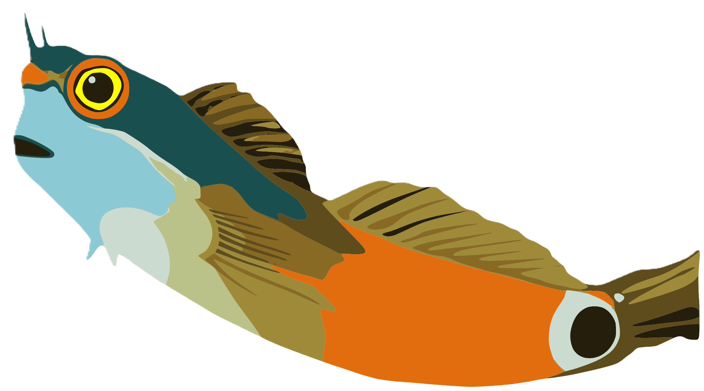

<div align="center">
  <h1>
    Blenny
    
  </h1>
</div>

**A free, open-source toolkit for analyzing colonies on petri plates.**

Blenny combines modern deep learning (YOLO) with classical computer vision to provide fast, accurate, and auditable colony counts from simple photos or high-res scans.


*Interactive review: Define custom analysis areas with polygonal masks, paint out contaminants with the exclusion tool, and instantly update counts by marking artifacts.*


*High-throughput mode: Automatically detect and analyze multiple plates in a single scan, with custom position-based labeling and individual plate review.*

---
## Test Blenny on Hugging Face
[Blenny on Hugging Face](https://huggingface.co/spaces/Pico25/blenny)
## Quick Start

### 1. Installation
Blenny supports **Python 3.11, 3.12, 3.13, and 3.14**.

#### Recommended: Install with pip
```bash
git clone https://github.com/sgreenb/blenny.git
cd blenny

# Create and activate a virtual environment (optional but recommended)
python -m venv .venv
source .venv/bin/activate        # macOS / Linux
# .venv\Scripts\activate         # Windows

# Install Blenny and all dependencies (Torch, Ultralytics, Streamlit, ...)
pip install -e .
```
To also install the development tools (pytest, ruff, mypy, pre-commit):
```bash
pip install -e ".[dev]"
```

> **Windows note:** If `blenny` isn't recognized as a command after install, either activate your virtual environment first or use `python -m blenny` (e.g., `python -m blenny gui`).

### 2. Run your first analysis
Starter pipelines are **shipped in the repository** (`pipeline_yolo.yaml`, `pipeline_classic.yaml`, and `pipeline_multi.yaml`), so you can run analysis immediately after cloning:

```bash
# Run the YOLO ML pipeline (Recommended: Faster and more robust)
blenny run pipeline_yolo.yaml --input plate.jpg --output results/

# Or the classical CV pipeline (no ML model needed)
blenny run pipeline_classic.yaml --input plate.jpg --output results/
```

If you ever modify or lose a pipeline file, `blenny init` regenerates all three starter pipelines from their built-in templates:
```bash
blenny init
```

### 3. View Results
Results land in `results/<image_name>/`:
- **`annotated.png`**: Original image with every detected colony outlined and numbered (the YOLO pipelines write one annotated image per plate, e.g. `plate_1_annotated.png`).
- **`colonies.csv`**: One row per colony with position, size, shape, color, and artifact-status measurements.
- **`<image_name>_run_summary.txt`** (classic) or **`log.txt`** (YOLO pipelines): A human-readable report with count statistics and quality flags.
- **`reproducible_config.yaml`**: The exact resolved pipeline config, so any analysis can be re-run verbatim.

---

## Standalone YOLO Counter (Fastest)

If you only need a quick count without plate detection or detailed quantification:

```bash
python yolo_count_only.py -in plates/ -out results/
```

---

## GUI
Launch the interactive interface with:
```bash
blenny gui
```

**Desktop shortcuts:** `Blenny GUI.lnk` (Windows) and `Blenny GUI.app` (macOS)
ship at the repo root — double-click either to launch the GUI without the
command line. `scripts/create_shortcut.ps1` and
`scripts/create_macos_shortcut.command` put a copy on your Desktop.

The GUI provides point-and-click analysis with **Interactive Review**:
- **Colony Counting**: automatic (Auto, Multi-Plate Grid) or manual (Manual Circle, Manual Polygon) plate detection, then review each plate in a table.
- **ROI Mode**: draw regions of interest on any image for per-region area and colour statistics — no pipeline needed.
- **Live Editing**: toggle the **"Artifact?"** box on any colony to flip its classification; the count updates instantly.
- **Manual Exclusion**: paint directly on the image to exclude contaminants or writing.

---

## Multi-Plate Analysis
For high-throughput scanning of multiple plates at once:
1. Use `pipeline_multi.yaml` (shipped in the repo, or regenerated by `blenny init`).
2. Run via CLI:
   ```bash
   blenny run pipeline_multi.yaml -i scan.jpg -o out/ -v detect_multi_plate.grid=[2,3]
   ```
3. Or use **Multi-Plate Grid** mode in the GUI for visual setup and labeling.

---

## Core Features

- **Automated Plate Detection**: Finds circular Petri dishes and crops/scales images automatically.
- **YOLO ML Integration**: High-accuracy detection using trained neural networks.
- **Smart Multiplicity**: Uses geometric heuristics to identify and count merged colonies.
- **Artifact Rejection**: Automatically filters out plate rims, scratches, and pen marks.
- **Quality Flags**: Warns you if a plate has a suspect count, many edge-touches, or poor detection confidence.
- **Batch Processing**: One-command analysis for entire directories with `batch_summary.csv`.

---

## Command Line Interface

| Command | Description |
| :--- | :--- |
| `blenny run` | Processes images through a YAML pipeline. |
| `blenny init` | Regenerates the starter pipelines (`pipeline_yolo.yaml`, `pipeline_classic.yaml`, `pipeline_multi.yaml`) from their templates. |
| `blenny modules` | Lists all available analysis modules and their parameters. |
| `blenny gui` | Launches the visual interface. |

### Key `blenny run` Options
- `--input`, `-i`: Input image path, directory, or quoted glob (e.g. `'plates/*.jpg'`).
- `--output`, `-o`: Directory to write results into.
- `--override`, `-v`: Tweak any parameter on the fly (e.g. `-v threshold_segment.min_area=50`), including inside sub-pipelines.
- `--confidence`, `--conf`: YOLO detection confidence threshold (0–1), applied to every `yolo_detector` step (default: 0.15 in shipped templates).
- `--provenance`: Save a full audit trail (`provenance.json`) per image.
- `--debug-dir`: Write intermediate step images for auditing.

---

## Quality Flags

| Code | Severity | Meaning |
| :--- | :--- | :--- |
| `plate_not_found` | warning | No circular plate found in the search range. |
| `low_plate_confidence` | warning | Best circle fit scored below the confidence threshold. |
| `no_objects` | warning | Segmenter found nothing after filtering. |
| `many_edge_touches` | warning | >10% of colonies touch the image border. |
| `suspect_high_count` | warning | Count exceeds 600 or coverage >50%; likely false positives. |
| `no_plates_found` | error | Multi-plate detector found zero plates in the scan. |
| `multiplicity_estimated` | info | Some detections were tagged as merged/overlapping colonies. |
| `artifacts_removed` | info | Edge detections rejected based on the interior profile. |

---

## Python API

```python
from blenny import Pipeline

# Load and run a pipeline
pipe = Pipeline.from_yaml("pipeline_yolo.yaml")
result = pipe.run("plate.jpg")

print(f"Found {result.metadata['colony_count']} colonies.")
```

## License

MIT. See [LICENSE](LICENSE).
