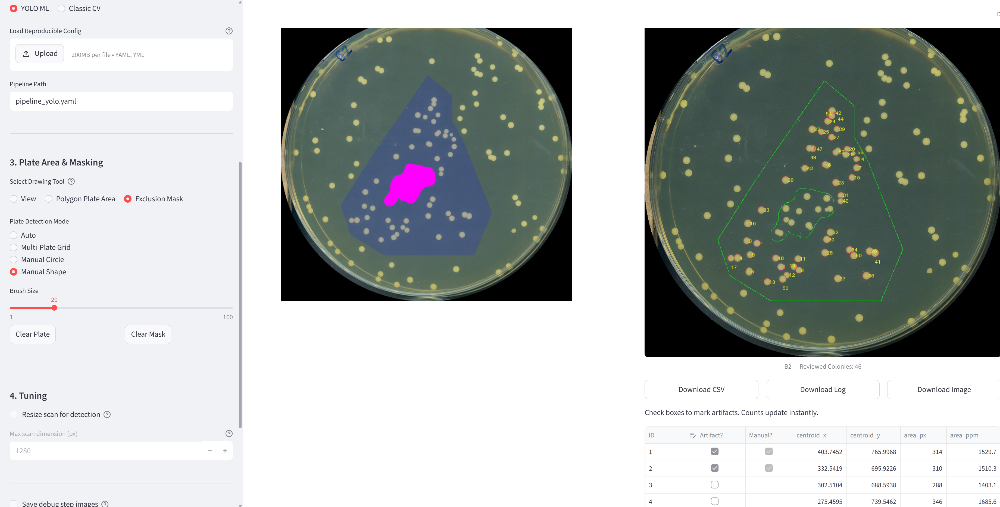
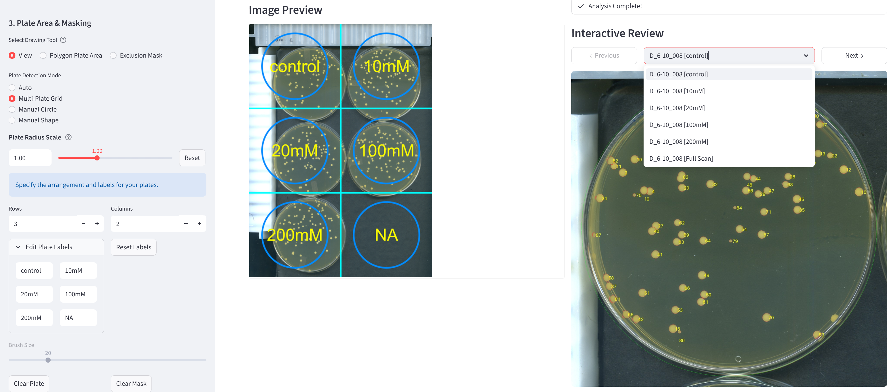

# Blenny

**A free, open-source toolkit for analyzing colonies on petri plates.**

Blenny combines modern deep learning (YOLO) with classical computer vision to provide fast, accurate, and auditable colony counts from simple photos or high-res scans.


*Interactive review: Define custom analysis areas with polygonal masks, paint out contaminants with the exclusion tool, and instantly update counts by marking artifacts.*


*High-throughput mode: Automatically detect and analyze multiple plates in a single scan, with custom position-based labeling and individual plate review.*

---

## Quick Start

### 1. Installation
Blenny requires Python 3.11+.

```bash
git clone https://github.com/sgreenb/blenny.git
cd blenny
pip install -e .
```

> **Windows note:** If `blenny` isn't recognized as a command after install, either activate your virtual environment first or use `python -m blenny` (e.g., `python -m blenny gui`).

### 2. Run your first analysis
```bash
# Generate default pipelines (pipeline_yolo.yaml, pipeline_classic.yaml, and pipeline_multi.yaml)
blenny init

# Run the YOLO ML pipeline (Recommended: Faster and more robust)
blenny run pipeline_yolo.yaml --input plate.jpg --output results/
```

### 3. View Results
Results land in `results/<image_name>/`:
- **`image_name_annotated.png`**: Original image with every detected colony outlined and numbered.
- **`image_name_colonies.csv`**: One row per colony with rich quantification data, including:
  - **Spatial**: ID, Centroid (X, Y), Area (px, ppm), Bounding Box.
  - **Morphology**: Circularity, Solidity, Eccentricity.
  - **Color**: Mean RGB and HSV values.
  - **Audit**: Artifact status, classification reason, and image source.
- **`image_name_run_summary.txt`**: A human-readable report with count statistics and quality flags.

---

## Standalone YOLO Counter (Fastest)

If you only need a quick count without plate detection or detailed quantification:

```bash
python yolo_count_only.py -in plates/ -out results/
```

---

## GUI
Launch the interactive interface with:
```bash
blenny gui
```

The GUI provides point-and-click analysis with **Interactive Review**:
- **Engine Selection**: Toggle between **YOLO ML** and **Classic CV**.
- **Live Editing**: Check or uncheck the **"Artifact?"** box on any colony to flip its classification—the count updates instantly.
- **Multi-Plate Support**: Automatically detect and analyze multiple plates in a single scan grid (e.g., 2x3).
- **Manual Exclusion**: Paint directly on the image to exclude contaminants or writing.

---

## Multi-Plate Analysis
For high-throughput scanning of multiple plates at once:
1. Use `pipeline_multi.yaml` (generated by `blenny init`).
2. Run via CLI:
   ```bash
   blenny run pipeline_multi.yaml -i scan.jpg -o out/ -v detect_multi_plate.grid=[2,3]
   ```
3. Or use **Multi-Plate Grid** mode in the GUI for visual setup and labeling.

---

## Core Features

- **Automated Plate Detection**: Finds circular Petri dishes and crops/scales images automatically.
- **YOLO ML Integration**: High-accuracy detection using trained neural networks.
- **Smart Multiplicity**: Uses geometric heuristics to identify and count merged colonies.
- **Artifact Rejection**: Automatically filters out plate rims, scratches, and pen marks.
- **Quality Flags**: Warns you if a plate has a suspect count, many edge-touches, or poor detection confidence.
- **Batch Processing**: One-command analysis for entire directories with `batch_summary.csv`.

---

## Command Line Interface

| Command | Description |
| :--- | :--- |
| `blenny run` | Processes images through a YAML pipeline. |
| `blenny init` | Scaffolds starter `pipeline_yolo.yaml`, `pipeline_classic.yaml`, and `pipeline_multi.yaml`. |
| `blenny modules` | Lists all available analysis modules and their parameters. |
| `blenny gui` | Launches the visual interface. |

### Key `blenny run` Options
- `--input`, `-i`: Input image path, directory, or quoted glob (e.g. `'plates/*.jpg'`).
- `--output`, `-o`: Directory to write results into.
- `--override`, `-v`: Tweak any parameter on the fly (e.g. `-v threshold_segment.min_area=50`).
- `--provenance`: Save a full audit trail (`provenance.json`) per image.
- `--debug-dir`: Write intermediate step images for auditing.

---

## Quality Flags

| Code | Severity | Meaning |
| :--- | :--- | :--- |
| `plate_not_found` | warning | No circular plate found in the search range. |
| `low_plate_confidence` | warning | Best circle fit scored below the confidence threshold. |
| `no_objects` | warning | Segmenter found nothing after filtering. |
| `many_edge_touches` | warning | >10% of colonies touch the image border. |
| `suspect_high_count` | warning | Count exceeds 600 or coverage >50%; likely false positives. |
| `multiplicity_estimated` | info | Some detections were tagged as merged/overlapping colonies. |
| `artifacts_removed` | info | Edge detections rejected based on the interior profile. |

---

## Python API

```python
from blenny import Pipeline

# Load and run a pipeline
pipe = Pipeline.from_yaml("pipeline_yolo.yaml")
result = pipe.run("plate.jpg")

print(f"Found {result.metadata['colony_count']} colonies.")
```

## License

GPL-3.0-or-later. See [LICENSE](LICENSE).
